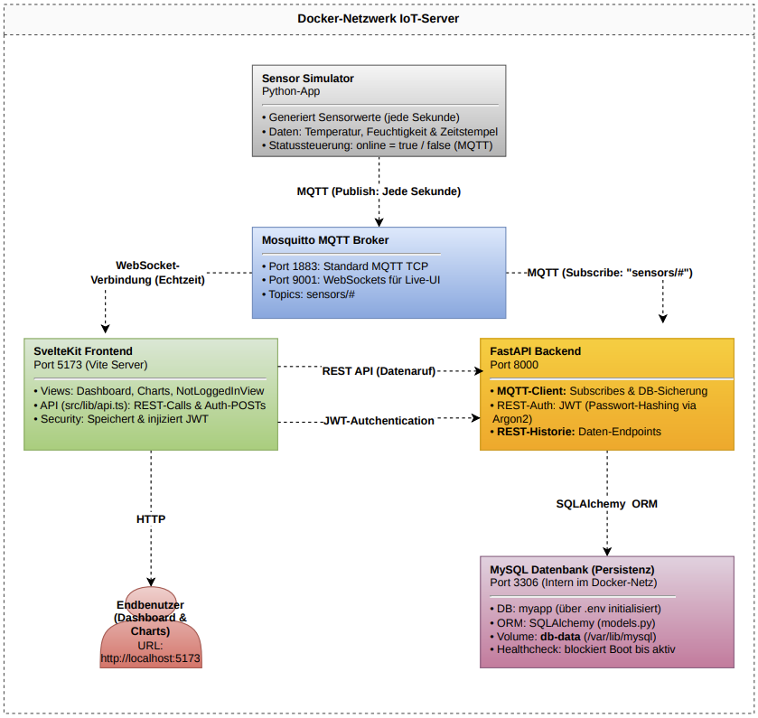

# IoT-Sensor Dashboard 

- **Backend**: FastAPI + MQTT + SQLAlchemy + MySQL + JWT-Authentifizierung (Argon2)
- **Frontend**: SvelteKit mit API-Hilfsfunktionen
- **Infrastruktur**: Docker Compose für alle Services

## Quickstart

```bash
# 1. .env aus Vorlage erstellen und Werte anpassen
cp .env.example .env

# 2. SECRET_KEY generieren (für JWT) – z.B. mit:
openssl rand -hex 32
Den Output in die `.env`-Datei als `SECRET_KEY` eintragen.

# 3. Alle Services bauen und starten
docker compose up -d --build

# 4. Fertig!
    Frontend:  http://localhost:5173
    Backend:   http://localhost:8000
    API-Docs:  http://localhost:8000/docs
```

## Projektstruktur

```
├── backend/                 # FastAPI Backend (Logik + DB + MQTT)
│   ├── main.py              # Einstiegspunkt, FastAPI App + Endpoints
│   ├── auth.py              # Authentifizierung (JWT + Passwort-Hashing)
│   ├── database.py          # Datenbankverbindung (SQLAlchemy)
│   ├── models.py            # Datenbankmodelle (Sensor, User, SensorValue)
│   ├── schemas.py           # API-Daten (Request/Response Modelle)
│   ├── mqtt_subscriber.py   # MQTT Subscriber → speichert Daten in DB
│   ├── router_historic.py   # Endpoints für historische Sensordaten
│   ├── requirements.txt     # Python-Abhängigkeiten
│   └── Dockerfile           # Backend Container Setup

├── frontend/                # Svelte Frontend (UI + Live Daten)
│   ├── package.json         # NodeJS Dependencies
│   ├── package-lock.json    # genaue Versionsauflösung
│   ├── svelte.config.js     # Svelte Konfiguration
│   ├── tsconfig.json        # TypeScript Einstellungen
│   ├── vite.config.ts       # Dev Server / Build Config
│   ├── Dockerfile           # Frontend Container Setup
│   │
│   └── src/
│       ├── app.html         # HTML Einstiegspunkt
│       ├── app.d.ts         # TypeScript Definitionen
│       ├── global.css       # globale Styles
│       │
│       ├── lib/
│       │   ├── api.ts                   # Kommunikation mit Backend API
│       │   ├── mqttService.svelte.ts    # MQTT Verbindung + Live Daten
│       │   │
│       │   └── Components/
│       │       ├── ActionButton.svelte        # Buttons innerhalb von Sensor-Information.svelte                
│       │       ├── Button.svelte              # Allgemein Button
│       │       ├── Dashboard.svelte           # Grundstruktur
│       │       ├── Header.svelte              # Header
│       │       ├── LogInView.svelte           # Anmeldesicht
│       │       ├── SensorCard.svelte          # Kurzinfo Sensor
│       │       ├── SensorChart.svelte         # Diagramme Historischer Daten
│       │       └── SensorInformation.svelte   # Detail Info Sensor
│       │
│       └── routes/
│           ├── +layout.svelte           # Layout der App
│           └── +page.svelte             # Hauptseite

├── mosquitto/              # MQTT Broker (Mosquitto)
│   ├── config/
│   │   └── mosquitto.conf  # Broker Konfiguration
│   ├── data/
│   │   └── mosquitto.db    # persistente MQTT Daten
│   └── log/
│       └── mosquitto.log   # Broker Logs

├── simulation/             # Sensor-Simulation (MQTT Publisher)
│   ├── simulator.py        # sendet Sensordaten an MQTT Broker
│   ├── requirements.txt    # Python Dependencies für Simulator
│   └── Dockerfile          # Container für Simulation
```

## Architekturdiagramm



